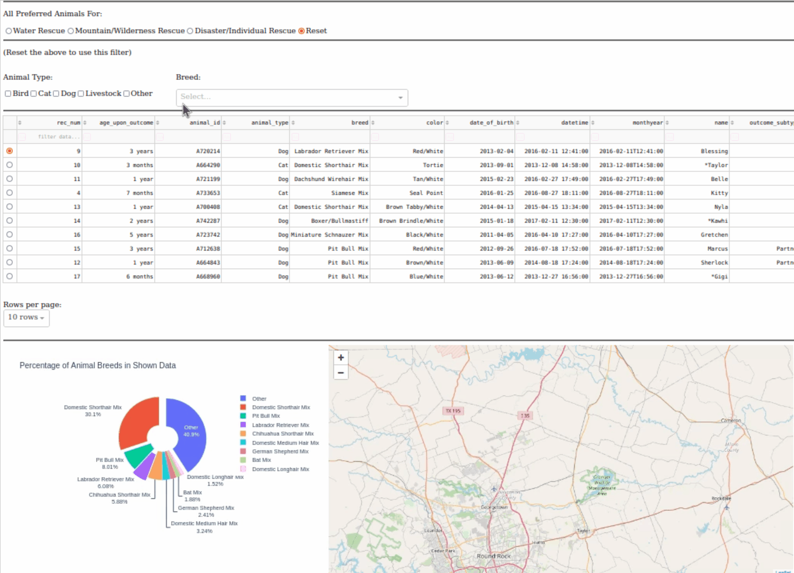

# Animal-Shelter

## Starting state of the Dashboard


## Interactive Filter Functionality Options



The above graphics interchange shows the functionality of radio buttons that provide data for the preferred animals for the categories of Water Rescue, Mountain or Wilderness Rescue, and Disaster/Individual Rescue. 
When a radio button is pressed, for example “Water Rescue”, the data table will be updated to show the animals in the animal shelter that can qualify for water rescues. 
The pie chart will also reflect the change made to the data table by showing the percentage of the most breeds seen in the filtered data. 
The map will show the location of where the first animal in the filtered data currently is by default. If the selected row is a different animal, the map will reflect the location of the selected animal.

### Additional Filter Functionality


The above graphics interactive showcases additional filter functionalities that can be utilized to make searching easier. Bear in mind that the radio button must be set to ‘Reset’ since it overrides this section.
If an animal type check box is checked, the data table will update to reflect the changes. For example, if only ‘Bird’ is checked, the data table will update to show only the list of birds in the database. If both ‘Bird' and ‘Livestock’ are checked, the data table will update to show a table containing both types of animals. 
If a breed type is selected in the dropdown, the data table will update to show breeds of that selected type. For example, if ‘Australian Shepherd’ is selected in the ‘Breed’ dropdown, the data table will show the list of ‘Australian Shepherd’ breed dogs.
The check box and the dropdown intersect in their results, which means if ‘Dog’ is checked and a Livestock breed is selected in the dropdown, the data table shown will be empty since there is no Dog that has a breed type of livestock.

### Pagination


Pagination works by selecting the number of rows to be shown at a time under the dropdown ‘Rows per page.’

### Advanced Filtering and Sorting


It is possible to sort and filter out the shown data table.

## Tools Used

### [Python](https://www.python.org)

Python is one of the most popular programming languages in the world and has become the de facto choice for many domains. Here is why it is an excellent choice for developing web applications:
-	It is versatile. Beyond web development, it can be used for data analysis, machine learning, automation, and many other tasks. This makes it ideal for projects that may start as a simple web app but grow in complexity over time.
-	It has extensive libraries and frameworks (Pandas, NumPy, and SciPy for data analysis).
-	Its clear syntax and readability accelerate development and problem-solving.
-	No need for bridging technologies with Dash since it is a Python-native framework.
-	Its interaction with databases like MongoDB is efficient. MongoDB's Python driver (PyMongo) is well-optimized and allows for fast data queries and updates.

### [MongoDB](https://www.mongodb.com)

MongoDB is used for backend data store. It is a popular choice for various reasons especially when interfacing with Python and developing web applications:
-	It is a document-oriented database, which means it stores data in collections of JSON-like documents. Python's dictionaries can easily be stored as JSON-like BSON (Binary JSON) documents in MongoDB.
-	It offers Python drivers such as ‘pymongo’ which allows for easy integration with Python applications. It allows developers to create, read, update, and delete records in the MongoDB database using Python. It is also integrated well with Python data-handling libraries like Pandas.
-	It supports lots of operators for matching, filtering, transforming, sorting, etc. This is particularly useful for analytics dashboards like the one shown in this paper.

### [Dash Framework](https://plotly.com/dash/)

Dah by Plotly is a Python framework that is used to build web applications with complex interactions and visualizations. It integrates Plotly graphics with Python using a simple interface. 
-	It allows developers to create web applications using only Python. 
-	It integrates seamlessly with Plotly’s graphics libraries which makes it easy to develop complex visualizations.
-	It allows for reactive programming by setting up callbacks. the app will automatically update in response to changes in input components, without requiring a page reload.
-	It offers a lot of form components (dropdowns, sliders, inputs, etc.), which makes it easy to gather input from users.
-	It naturally integrates well with the broader Python data ecosystem, with libraries like Pandas, NumPy, and more.

-	It acts as both the "view" and the "controller". The "view" is defined by the layout, which consists of various UI components (like dropdowns, radio items, and tables).
-	The "controller" aspect is managed by Dash's callbacks, which determine how the input data (from user interactions) affects the output.
-	MongoDB serves as the "model", storing the data and serving it based on queries from the Dash app.

## Challenges Encountered

-	In the Dash framework, handling interactive elements and interdependencies became a little complex at one time. I found that the interactivity if Dash components may result in circular dependencies (as I encountered with the "Dependency Cycle Found" error). I solved this by refactoring the callback functions and being mindful of the Input-Output relationships that can resolve these dependencies. 
-	Ensuring multiple filters (like the dropdown, checklist, and radio buttons) work together seamlessly was challenging. I made it so that they don’t interfere with each other to produce errors. 
-	It was challenging to design a user-friendly interface with Dash since it focuses more on functionality. I had to use external CSS to improve the application’s aesthetics and user experience. 

## How to Reproduce the Project

- Clone this repository
-	Install python and pip from www.python.org/download. 
-	Install MongoDB from https://www.mongodb.com/try/download/community. 
-	Install the MongoDB shell from https://www.mongodb.com/try/download/shell.
-	Open the command line.
-	Install the PyMongo library using: pip install pymongo
-	Install the Dash Framework using: pip install dash
-	Install Pandas library using: pip install pandas
-	Install numpy using: pip install numpy
-	Navigate to your .csv directory: cd /(enter directory here without the brackets)
-	Import the csv database into mongoDB using (you can change the username, password, port and host to your liking, This would be the access point of the main admin):<br/>
```mongoimport --username="${MONGO_USER}" --password="${MONGO_PASS}" --port=${MONGO_PORT} --host=${MONGO_HOST} --db AAC --collection animals --authenticationDatabase admin --drop --type csv --headerline ./(Enter csv file name here without the brackets).csv```
-	Connect to MongoDB and switch to the mongo shell using: mongosh
-	Check to see if the database has been imported into the Mongo shell using the following command. It will show an “AAC” database.<br/>
```show dbs```
- Make sure that all environment variables and files are in the same directory,
-	Open the Python file “mongoDataAccessObject.py” using an IDE of your choice.
  -	In this file, there is a class that leverages PyMongo. 
  -	The host and port variables can be changed according to your previous mongoimport command.
  -	It contains all the necessary methods to manipulate data in MongoDB.
  -	Create (addAnimal):<br/>
    •	Input: A dictionary representing an animal record.<br/>
    •	Action: Insert the provided record into the Animal collection.<br/>
    •	Output: Returns True if the operation is successful.<br/>
  -	Read (getAllAnimals):<br/>
    •	Input: None<br/>
    •	Action: Fetches all records from the Animal collection.<br/>
    •	Output: Returns a list of dictionaries, each representing an animal record.<br/>
  -	Read with selected criteria (getAllAnimalsWithCriteria):<br/>
    •	Input: A dictionary containing the query criteria.<br/>
    •	Action: Fetches all records from the Animal collection that match with criteria.<br/>
    •	Output: Returns a list of dictionaries with animal documents that match the criteria.<br/>
  -	Update (modifyAnimals):<br/>
    •	Input:<br/>
            -	criteria: A dictionary with key-value pairs specifying which records to update.<br/>
            -	updates: A dictionary representing the changes to be made.<br/>
    •	Action: Updates records in the Animal collection that match the given criteria with the provided updates.<br/>
    •	Output: Returns the number of records modified.<br/>
  -	Delete (removeAnimals):<br/>
    •	Input: ‘criteria’: A dictionary with key-value pairs specifying which records to delete.<br/>
    •	Action: Deletes records from the Animal collection that match the given criteria.<br/>
    •	Output: Returns the number of records deleted.<br/>
-	Open the file “Dashboard.ipynb”.
  -	Here you’ll find the dashboard code that accesses the imported MongoDB data via the Python crud app “mongoDataAccessObject.py”. It creates a Dash interface website on the said port.
  -	The username and password are hard coded but can be changed accordingly. 
  -	Run this file and click on the Dash app port to access the Dash app on a browser.


